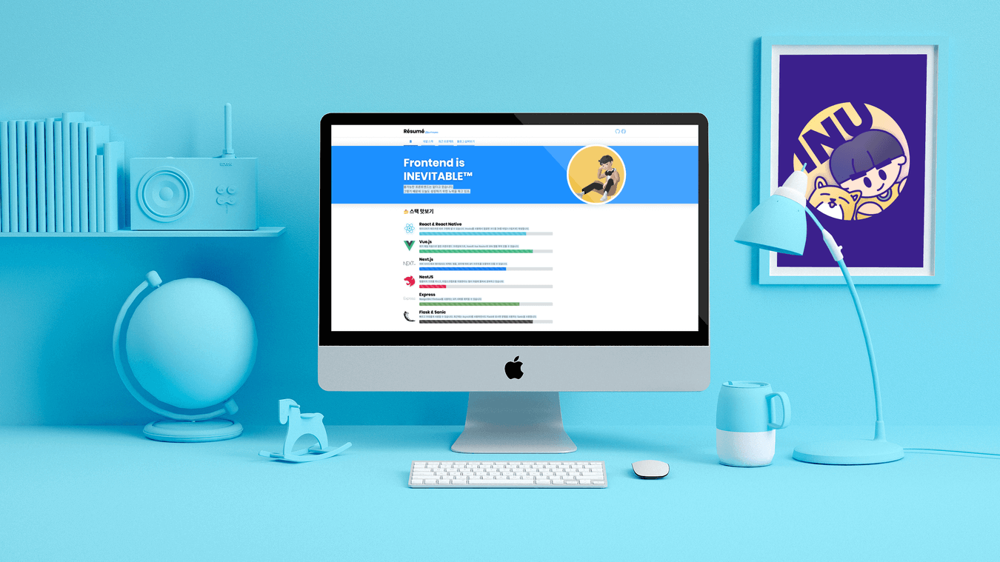
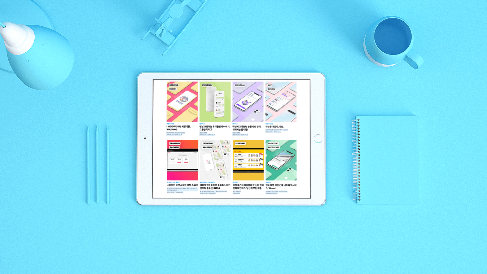
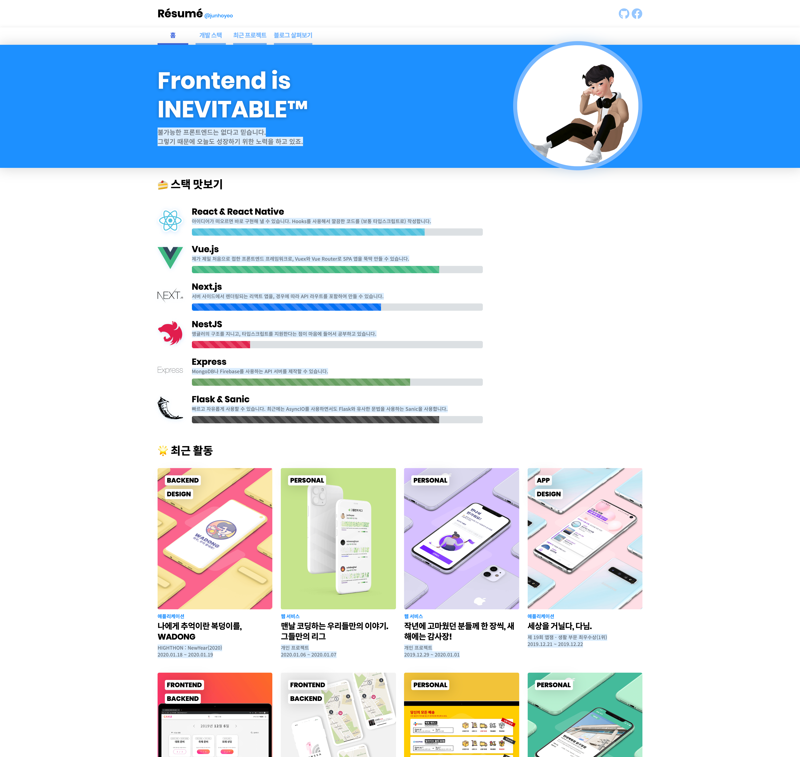
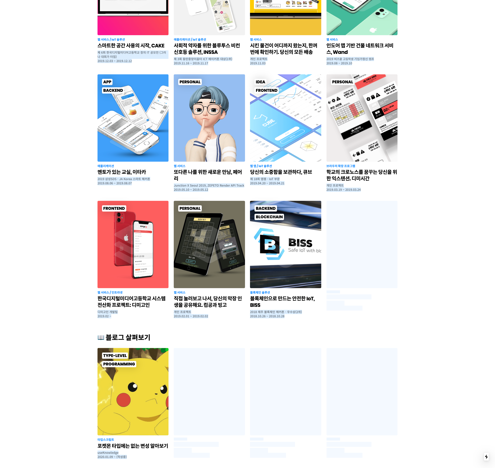
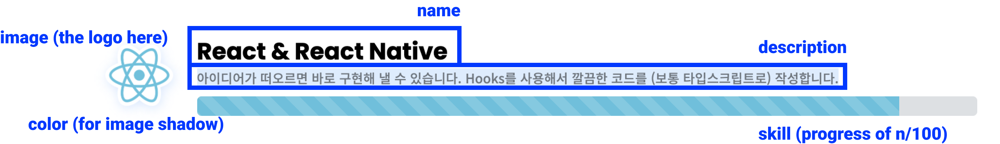
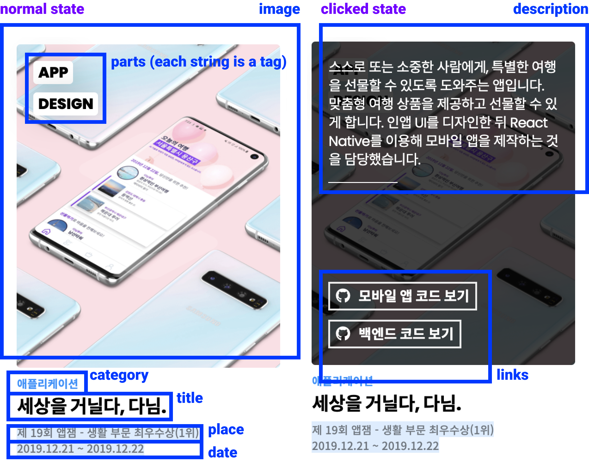

<h1 align="center">
  Trendy Résumé
</h1>

<div align="center">
  
  <blockquote>Hello, this is my trendy new <a href="https://trendy-resume.now.sh/">résumé</a>. Wanna make one for yourself too?<br />
  <small><i>최근 시간적인 문제로 개인 이력서를 업데이트하고 있지 못하고 있어서,<br />혹시라도 <strong>제 최신 이력서 또는 영문 이력서</strong>를 필요로 하는 분이 계시다면, <a href="https://github.com/junhoyeo/trendy-resume/issues">여기</a>에 이슈를 남겨 주시거나 개인적으로 연락해주세요 🙏</i></small></blockquote>
</div>

[](https://github.com/dwyl/esta/issues)
[](https://github.com/microsoft/TypeScript)

- [🇺🇸 English (영어)](./README.ko.md)

## 👀 미리보기





<div align="center">
  
</div>

## ❤️ 사용 사례
여러분의 것도 추가해 주세요! 🥰

- [trendy-resume.now.sh](https://trendy-resume.now.sh)
- [kdw.now.sh](https://kdw.now.sh)
- [seungmin.io](https://seungmin.io)
- [about.mingeun.com](https://about.mingeun.com) (inspired from design)

## 🏗 직접 만들어 보세요!

### 1. 먼저, 이 저장소를 복제합니다.
여러분의 계정으로 클론해서 사용하거나, [템플릿 기능을 사용](https://github.com/junhoyeo/trendy-resume/generate)해서 새로운 저장소를 만들 수도 있어요!

### 2. 로컬 서버에서 개발하기

```bash
git clone https://github.com/your-nickname/some-repository.git
# 전 단계에서 만든 저장소의 클론 링크입니다.

cd some-repository
# 새로 만들어진 저장소의 폴더로 이동하세요.

yarn
# 패키지 매니저를 사용해 의존성을 설치합니다.
# 물론 npm을 사용할 수도 있습니다.
# 그 경우 필요 없어지는 yarn.lock을 삭제해도 상관 없을 거예요.

yarn dev
# 개발 서버를 시작합니다. (npm run dev)
```

### 3. 배포 설정하기

> ⚠️ 이 프로젝트는 Next.js를 사용합니다! ⚠️
>
> 페이지를 추가하거나, 랜덤 값을 생성하거나, 렌더링 관련 기능을 개발하실 때 참고해 주세요! 👍

Next.js를 지원하는 [ZEIT](https://zeit.co/), Github Pages, Heroku 등의 서비스를 사용하면 빠르게 배포할 수 있어요!

### 4. 설정 바꾸기
이제 파일을 훑어보면서 마음껏 바꿔도 좋아요! 🔥

## 🔍 문서
빠른 시일 내에 자세한 문서와 함께 더 많은 것들을 쉽게 설정해서 적용할 수 있도록 해 드릴게요! [Issues](https://github.com/junhoyeo/trendy-resume/issues)와 [Pull Requests](https://github.com/junhoyeo/trendy-resume/pulls)를 통해서 저를 도와줄 수 있어요! 😘

### 👋 기본 정보

#### 예시

```json
{
  "title": "Résumé",
  "author": "junhoyeo",
  "catchphrase": {
    "text": "Frontend is \nINEVITABLE™",
    "description": [
      "불가능한 프론트엔드는 없다고 믿습니다.",
      "그렇기 때문에 오늘도 성장하기 위한 노력을 하고 있죠."
    ]
  }
}
```

#### 미리보기


#### 참고 자료

| 이름 | 설명 | 위치 |
| --- | --- | --- |
| 설정 파일 | JSON 설정 파일 | [src/data/info.json](./src/data/info.json) |
| 타입 | 오브젝트 타이핑 | [src/utils/types.ts](./src/utils/types.ts) (interface `IInfo`) |

#### 필드별 설명

| 이름 | 설명 | 예시 |
| ----- | ----------- | ------- |
| `title` | 제목 | `Résumé` |
| `author` | 제목 옆의 작가 이름 | `junhoyeo` |
| `catchphrase.text` | 캐치프레이즈 | `Frontend is \nINEVITABLE™` |
| `catchphrase.description` | 캐치프레이즈 밑에 있는 설명(한 줄씩 렌더링됨) | `["불가능한 프론트엔드는 없다고 믿습니다.", "그렇기 때문에 오늘도 성장하기 위한 노력을 하고 있죠."]` |

### 🤝 소셜 링크 (페이지 상단 우측에 표시됩니다!)
미리보기는 위에 있는 헤더 그림을 참고해 주세요.

#### 예시

```json
[
  {
    "name": "github",
    "icon": "fab fa-github",
    "href": "https://github.com/junhoyeo"
  },
  {
    "name": "facebook",
    "icon": "fab fa-facebook",
    "href": "https://www.facebook.com/juno3704"
  }
]
```

#### 참고 자료

| 이름 | 설명 | 위치 |
| --- | --- | --- |
| 설정 파일 | 오브젝트 리스트를 포함하고 있는 JSON 설정 파일 | [src/data/social.json](./src/data/social.json) |
| 타입 | 하나의 오브젝트에 대한 타이핑 | [src/utils/types.ts](./src/utils/types.ts) (interface `ILink`) |

#### 필드별 설명

| 이름 | 설명 | 예시 |
| ----- | ----------- | ------- |
| `title` | 네비게이션 이름 | `github` |
| `icon` | [Font Awesome](https://fontawesome.com/)에서의 아이콘 클래스 이름 | `fab fa-github` |
| `href` | 링크를 클릭했을 때 이동하는 위치 | `https://github.com/junhoyeo` |

### 🕵️‍♂️ 네비게이션
미리보기는 위에 있는 헤더 그림을 참고해 주세요.

#### 예시

```json
[
  {
    "name": "홈",
    "href": "#"
  },
  {
    "name": "개발 스택",
    "href": "#stacks"
  },
  {
    "name": "최근 프로젝트",
    "href": "#recent"
  },
  {
    "name": "블로그 살펴보기",
    "href": "#blog"
  }
]
```

#### 참고 자료

| 이름 | 설명 | 위치 |
| --- | --- | --- |
| 설정 파일 | 오브젝트 리스트를 포함하고 있는 JSON 설정 파일 | [src/data/navigations.json](./src/data/navigations.json) |
| 타입 | 하나의 오브젝트에 대한 타이핑 | [src/utils/types.ts](./src/utils/types.ts) (interface `INavigation`) |

#### 필드별 설명

| 이름 | 설명 | 예시 |
| ----- | ----------- | ------- |
| `name` | 네비게이션 이름 | `홈`, `개발 스택`, `최근 프로젝트` |
| `href` | 네비게이션 바를 클릭했을 때 이동할 위치(보통 `id` 태그를 이용한 북마크) | `#home`, `#stacks`, `#recent` |

### 👩🏼‍💻 아바타

#### 예시
```json
[
  {
    "image": "coffee.png"
  },
  {
    "image": "default.png"
  },
  {
    "image": "poze.png",
    "contain": true
  }
]
```

#### 참고 자료

| 이름 | 설명 | 위치 |
| --- | --- | --- |
| 설정 파일 | 오브젝트 리스트를 포함하고 있는 JSON 설정 파일 | [src/data/avatar.json](./src/data/avatar.json) |
| 타입 | 하나의 오브젝트에 대한 타이핑 | [src/utils/types.ts](./src/utils/types.ts) (interface `IAvatar`) |

#### 필드 정보

| 이름 | 설명 | 필수 여부 |
| ----- | ----------- | -------- |
| `image` | [public/static/avatar](https://github.com/junhoyeo/trendy-resume/tree/main/public/static/avatar) 폴더에 있는 아바타(프로필 사진) 파일의 이름 | `true` |
| `contain` | `true`면 렌더링된 이미지 태그의 `object-fit` 스타일이 `contain`로 설정됨(`false`거나 제공되지 않았을 경우 `cover`) | `false` |

### 📚 스택

#### 예시

```json
[
  {
    "name": "React & React Native",
    "image": "react.png",
    "skill": 90,
    "color": "#52C1DE",
    "description": "아이디어가 떠오르면 바로 구현해 낼 수 있습니다. Hooks를 사용해서 깔끔한 코드를 (보통 타입스크립트로) 작성합니다."
  }
]
```

#### 미리보기



#### 참고 자료

| 이름 | 설명 | 위치 |
| ---- | ----------- | ------- |
| 설정 파일 | 오브젝트 리스트를 포함하고 있는 JSON 설정 파일 | [src/data/stacks.json](./src/data/stacks.json) |
| 타입 | 하나의 오브젝트에 대한 타이핑 | [src/utils/types.ts](./src/utils/types.ts) (interface `IStack`) |

#### 필드 정보

| 이름 | 설명 | 필수 여부 |
| ----- | ----------- | -------- |
| `name` | 스택 이름 | `true` |
| `image` | [public/static/stacks](https://github.com/junhoyeo/trendy-resume/tree/main/public/static/stacks) 폴더에 있는 스택 이미지(로고) 파일의 이름 | `true` |
| `skill` | 백분위로 나타낸 기술 숙련도(`0`에서 `100` 사이의 `number`) | `true` |
| `color` | 해당 스택의 브랜드 색(이미지 아래 나타나는 그림자 색과 숙련도 바 색에 적용됨) | `true` |
| `description` | 스택 설명 | `true` |

### 📦 프로덕트(프로젝트)

#### 예시

```json
[
 {
    "image": "static/products/danim.png",
    "title": "세상을 거닐다, 다님.",
    "parts": [
      "APP",
      "DESIGN"
    ],
    "category": "애플리케이션",
    "place": "제 19회 앱잼 - 생활 부문 최우수상(1위)",
    "date": "2019.12.21 ~ 2019.12.22",
    "description": "스스로 또는 소중한 사람에게, 특별한 여행을 선물할 수 있도록 도와주는 앱입니다. 맞춤형 여행 상품을 제공하고 선물할 수 있게 합니다. 인앱 UI를 디자인한 뒤 React Native를 이용해 모바일 앱을 제작하는 것을 담당했습니다.",
    "links": [
      {
        "icon": "fab fa-github",
        "text": "모바일 앱 코드 보기",
        "href": "https://github.com/junhoyeo"
      },
      {
        "icon": "fab fa-github",
        "text": "백엔드 코드 보기",
        "href": "https://github.com/junhoyeo"
      }
    ]
  }
]
```

#### 미리보기

<div align="center">
  
</div>

#### 참고 자료

| 이름 | 설명 | 위치 |
| ---- | ----------- | ------- |
| 설정 파일 | 오브젝트 리스트를 포함하고 있는 JSON 설정 파일 | [src/data/products.json](./src/data/products.json) |
| 타입 | 하나의 오브젝트에 대한 타이핑 | [src/utils/types.ts](./src/utils/types.ts) (interface `IProduct`) |

#### 필드 정보

| 이름 | 설명 | 필수 여부 |
| ----- | ----------- | -------- |
| `image` | [public/static/products](https://github.com/junhoyeo/trendy-resume/tree/main/public/static/products) 폴더에 있는 프로젝트 이미지 파일의 이름 | `true` |
| `title` | 프로젝트 제목 | `true` |
| `parts` | `string` 타입의 리스트로 이루어진 우측 상단에 표시되는 태그 목록(프로젝트에서 본인이 담당한 역할을 표시하는 용도) | `false` |
| `place` | 프로젝트를 진행한 대회 또는 장소, 수상 및 성과 등 | `false` |
| `date` | 개발 기간 | `false` |
| `description` | 프로젝트 설명(카드를 클릭했을 경우에 보여짐) | `false` |
| `links` | `ILink` 인터페이스로 이루어진, 프로젝트와 관련된 링크 목록(카드를 클릭했을 경우에 보여짐) | `false` |

### 📖 블로그 포스트
블로그 포스트의 경우, 프로덕트의 모델/타입과 완전히 동일합니다.

#### 참고 자료

| 이름 | 설명 | 위치 |
| ---- | ----------- | ------- |
| 설정 파일 | 오브젝트 리스트를 포함하고 있는 JSON 설정 파일 | [src/data/posts.json](./src/data/posts.json) |
| 타입 | 하나의 오브젝트에 대한 타이핑 | [src/utils/types.ts](./src/utils/types.ts) (interface `IProduct`) |

## 🍭 팁 몇 개
아래는 제가 포트폴리오를 디자인하면서 사용했던 서비스들이예요!

| 서비스나 자료 이름 | 설명 | 대체품 |
| ------------- | --- | ----- |
| [Zepeto](https://zepeto.me/) | 쉽게 자신과 비슷한 ~~???~~ 아바타를 만들고, 사진을 찍을 수 있어요. | 얼굴 인식 이모지 솔루션이 그나마 괜찮을 것 같긴 한데, 좀 더 알아봐야 할 것 같아요. |
| [Smartmockups](https://smartmockups.com/) | 제가 사용한 목업 몇 개는 여기에서 생성했습니다. 다루기도 쉽고 진짜 예쁘긴 한데, 저와 같은 체험판 버전 사용자가 생성한 목업은 구석이랑 가운데에 작은 워터마크가 들어간다는 단점이 있어요. 또, 같은 디바이스가 여러 개 있는 목업 레이아웃이 없어서 마음이 약간 아픕니다. | 무료 목업 PSD 파일을 받아, 포토샵으로 편집하는 게 가장 ~~귀찮지만~~ 좋긴 하네요. |

포트폴리오를 만들다 참고한 자료가 있다면 여기에 추가해주세요!
